# Build a 28-Agent Advisory Firm

> Inside the [Solo Startup Systems Engineering](../../README.md) portfolio · *Systems for building and scaling a startup as a solo operator.*

## Overview

In this project, I built a 28-agent advisory platform designed to automate operational workflows while preserving strict advisory-only boundaries. The objective was to reduce repetitive execution work and create an AI-assisted consulting system focused on assessment, analysis, and strategic recommendations rather than implementation delivery.

The platform combines multi-agent orchestration, retrieval-augmented generation, compliance-aware retrieval, Google Workspace integration, PostgreSQL tenancy controls, and governance enforcement into a single operational environment. Instead of operating as disconnected prompts, the agents function as coordinated advisory specialists operating under a centralized constitutional framework.

The architecture is built across **9 phases**, anchored by **The Vision: Building a 28-Agent Advisory Firm** on the input side and **Multi-Tenant Enterprise Extension** at the end. Each phase is listed in the Implementation section below.

## Architecture

```mermaid
---
title: Build a 28-Agent Advisory Firm
---
%%{init: {"theme":"base","themeVariables": {"primaryColor":"#1B4332","primaryTextColor":"#F4D03F","primaryBorderColor":"#F4D03F","secondaryColor":"#264653","tertiaryColor":"#2F5233","lineColor":"#F4D03F","fontFamily":"ui-monospace, SFMono-Regular, Menlo, Consolas, monospace","fontSize":"13px"}}}%%
flowchart LR
    classDef datastore fill:#264653,stroke:#F4D03F,stroke-width:2px,color:#FFFFFF
    classDef service fill:#1B4332,stroke:#F4D03F,stroke-width:2px,color:#F4D03F
    classDef event fill:#7B42BC,stroke:#F4D03F,stroke-width:2px,color:#FFFFFF
    classDef io fill:#0d1117,stroke:#F4D03F,stroke-width:1.5px,color:#F4D03F,font-style:italic

    subgraph Inbound["Client Inbound"]
        ClientReq[/Client Advisory Request/]
        GmailIn[/Gmail Intake/]
    end

    subgraph Control["Operations Control Plane"]
        Streamlit(Streamlit Dashboard)
        Plotly(Plotly KPI Visualizations)
        Scheduler(APScheduler Cron Jobs)
    end

    subgraph Governance["Governance and Refusal Layer"]
        Refusal(Implementation-Language Refusal Scanner)
        Council(Council Scoring - 4 Weighted Dimensions)
        AdvisoryContract[(Advisory-Positioning Contract - RAG-Retrieved)]
        VetoGate{{Council Veto - Scope Violation}}
    end

    subgraph AgentPool["28 Agents Across 9 Teams"]
        FastAPI(FastAPI Orchestration Endpoints)
        Personas(Pydantic Persona Models)
        YamlContracts[(YAML Behavioral Contracts)]
        Agents(28 Advisory Agents - 9 Specialty Teams)
    end

    subgraph Knowledge["Knowledge and Retrieval"]
        Obsidian[(Obsidian Vault - Frameworks and Templates)]
        Chroma[(Chroma Vector Store)]
        Postgres[(PostgreSQL Business Data)]
        Watchdog(Watchdog Re-ingest)
        KeywordFallback(Keyword Fallback - Compliance Tokens)
    end

    subgraph Workspace["Google Workspace Bridge"]
        ServiceAcct(Service Account - Domain-Wide Delegation)
        Drive(Drive Sync)
        Calendar(Calendar Scheduling)
        Docs(Docs Export)
        Rclone(rclone Bidirectional Sync)
        SmartRouter(Gmail Smart Router)
    end

    subgraph Privacy["PII Protection"]
        Presidio(Presidio PII Analyzer)
        PIIGate{{PII Threshold Block}}
    end

    subgraph Tenancy["Multi-Tenant Extension"]
        RLS(PostgreSQL Row-Level Security)
        Ollama(Local Ollama Routing)
        Telemetry(Tenant-Scoped Telemetry)
    end

    subgraph Outputs["Outputs"]
        AdvisoryOut[/Assessment Analysis Strategic Recommendation/]
        PartnerRedirect[/Redirect to Implementation Partner/]
    end

    ClientReq -->|inbound request| Refusal
    GmailIn -->|inbound email| SmartRouter
    SmartRouter -->|classified intake| Refusal
    Refusal -->|implementation intent detected| PartnerRedirect
    Refusal -->|advisory intent confirmed| FastAPI
    AdvisoryContract -->|enforces boundaries| Refusal
    FastAPI -->|dispatches to specialist team| Agents
    Personas -->|hydrates each agent role| Agents
    YamlContracts -->|defines team behavior| Agents
    Agents -->|RAG query| Chroma
    Obsidian -->|chunked and embedded into| Chroma
    Watchdog -->|monitors vault and triggers| Chroma
    Chroma -->|semantic retrieval| Agents
    KeywordFallback -->|exact-token fallback for| Agents
    Postgres -->|tenant business records| Agents
    RLS -->|isolates tenant queries on| Postgres
    Ollama -.->|local-tenant LLM route| Agents
    Agents -->|deliverable artifact| Council
    Council -->|scope check| VetoGate
    VetoGate -->|veto on implementation language| PartnerRedirect
    VetoGate -->|approved deliverable| Presidio
    Presidio -->|threshold breach| PIIGate
    PIIGate -->|blocked from export| Council
    PIIGate -->|cleared for export| Docs
    ServiceAcct -->|impersonation scopes| Drive
    ServiceAcct -->|impersonation scopes| Calendar
    ServiceAcct -->|impersonation scopes| Docs
    ServiceAcct -->|impersonation scopes| SmartRouter
    Drive <-->|bidirectional file sync| Rclone
    Docs -->|exports advisory artifact| AdvisoryOut
    Calendar -->|client engagement slot| AdvisoryOut
    Streamlit -->|reads KPI metrics from| Postgres
    Plotly -->|renders into| Streamlit
    Scheduler -->|triggers periodic jobs| FastAPI
    Telemetry -->|live tenant metrics| Streamlit

    class AdvisoryContract,YamlContracts,Obsidian,Chroma,Postgres datastore
    class Streamlit,Plotly,Scheduler,Refusal,Council,FastAPI,Personas,Agents,Watchdog,KeywordFallback,ServiceAcct,Drive,Calendar,Docs,Rclone,SmartRouter,Presidio,RLS,Ollama,Telemetry service
    class VetoGate,PIIGate event
    class ClientReq,GmailIn,AdvisoryOut,PartnerRedirect io
```

The diagram shows the topology and data flow of the system as built. The full architectural narrative, with screenshots and prose, lives in [`documents/28-agent-advisory-firm.md`](./documents/28-agent-advisory-firm.md).

## Implementation

This system is built across **9 phases**:

1. **The Vision: Building a 28-Agent Advisory Firm**
2. **Launching the Streamlit Dashboard and Full Infrastructure**
3. **Smoke Testing Across 5 Regulated Verticals**
4. **Scaffolding 28 Agents with Advisory-Only Refusal Rules**
5. **Enabling Google Workspace APIs and Service Account Access**
6. **Structuring the Obsidian Vault and PostgreSQL Data Layer**
7. **Wiring RAG and Chroma for Compliance-Aware Retrieval**
8. **Connecting the Google Workspace Sync Bridge**
9. **Multi-Tenant Enterprise Extension**

For the full walkthrough with screenshots and step-by-step content, see [`documents/28-agent-advisory-firm.md`](./documents/28-agent-advisory-firm.md).

## Validation

Build outcomes verified end-to-end. Each phase below is captured with screenshots, configuration, and observable behavior in [`documents/28-agent-advisory-firm.md`](./documents/28-agent-advisory-firm.md):

- ✅ The Vision: Building a 28-Agent Advisory Firm
- ✅ Launching the Streamlit Dashboard and Full Infrastructure
- ✅ Smoke Testing Across 5 Regulated Verticals
- ✅ Scaffolding 28 Agents with Advisory-Only Refusal Rules
- ✅ Enabling Google Workspace APIs and Service Account Access
- ✅ Structuring the Obsidian Vault and PostgreSQL Data Layer
- ✅ Wiring RAG and Chroma for Compliance-Aware Retrieval
- ✅ Connecting the Google Workspace Sync Bridge
- ✅ Multi-Tenant Enterprise Extension
