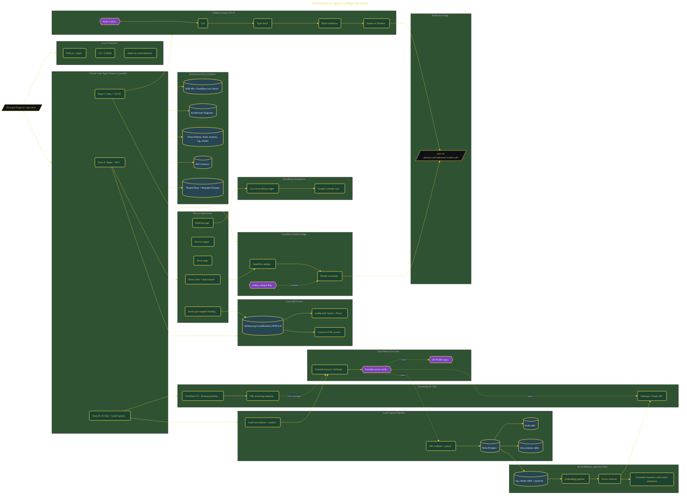

# Orchestrate AI Agents to Ship Full-Stack

> Inside the [Solo Startup Systems Engineering](../../README.md) portfolio · *Systems for building and scaling a startup as a solo operator.*

## Overview

The thesis: one Principal Engineer + AI Agent Teams = a full squad's output

In this project, I orchestrated three parallel AI agent teams using Claude Code Agent Teams to deliver a production-style lead generation platform within a compressed delivery window. The solution combined a streaming AI chat assistant, scheduling integration, serverless persistence, geo-targeted marketing pages, and automated deployment workflows into a single operating system.

The objective was not simply shipping a website. The goal was to practice architecture-first decomposition, parallel execution, and AI-assisted delivery patterns where a single engineer coordinates specialist agents to produce outputs normally requiring multiple engineering roles. The final system demonstrated AI orchestration, edge deployment, CI/CD automation, and customer acquisition workflows operating together as one platform.

The architecture is built across **9 phases**, anchored by **Orchestrating AI Agent Teams to Ship at 10x Velocity** on the input side and **RAG-Grounded Knowledge Base with pgvector** at the end. Each phase is listed in the Implementation section below.

## Architecture

The diagram shows the topology and data flow of the system as built. The full architectural narrative, with screenshots and prose, lives in [`documents/agent-orchestrated-advisory-platform.md`](./documents/agent-orchestrated-advisory-platform.md).

## Implementation

This system is built across **9 phases**:

1. **Orchestrating AI Agent Teams to Ship at 10x Velocity**
2. **Setting Up the Infrastructure Foundation**
3. **Architecture-First Decomposition with Parallel Agents**
4. **Scaffolding Next.js on Cloudflare Workers**
5. **Building Core Pages and Geo-Targeted Landing**
6. **Streaming AI Chat Agent with Anti-Abuse Guardrails**
7. **Lead Capture Pipeline Writing to Neon Postgres**
8. **Deploying to Production and Establishing CI**
9. **RAG-Grounded Knowledge Base with pgvector**

For the full walkthrough with screenshots and step-by-step content, see [`documents/agent-orchestrated-advisory-platform.md`](./documents/agent-orchestrated-advisory-platform.md).

## Validation

Build outcomes verified end-to-end. Each phase below is captured with screenshots, configuration, and observable behavior in [`documents/agent-orchestrated-advisory-platform.md`](./documents/agent-orchestrated-advisory-platform.md):

- ✅ Orchestrating AI Agent Teams to Ship at 10x Velocity
- ✅ Setting Up the Infrastructure Foundation
- ✅ Architecture-First Decomposition with Parallel Agents
- ✅ Scaffolding Next.js on Cloudflare Workers
- ✅ Building Core Pages and Geo-Targeted Landing
- ✅ Streaming AI Chat Agent with Anti-Abuse Guardrails
- ✅ Lead Capture Pipeline Writing to Neon Postgres
- ✅ Deploying to Production and Establishing CI
- ✅ RAG-Grounded Knowledge Base with pgvector
