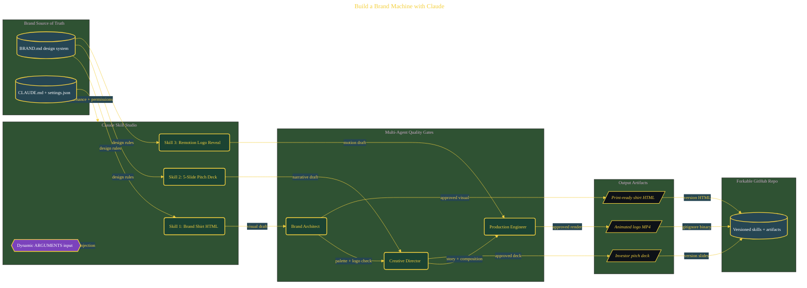

# Build a Brand Machine with Claude

> Inside the [Solo Startup Systems Engineering](../../README.md) portfolio · *Systems for building and scaling a startup as a solo operator.*

## Overview

This project builds a Claude skill studio that generates brand-consistent artifacts through a governed, multi-agent pipeline.

The system transforms a static brand definition into a repeatable production process that outputs merch, pitch decks, and video assets. Instead of manually designing each artifact, the pipeline enforces consistency through a shared design system and automated quality gates. The goal is to move from ad hoc creative work to a controlled system where outputs are predictable, auditable, and aligned across all media.

The architecture is built across **10 phases**, anchored by **The Mission: A Governed Creative Pipeline** on the input side and **Setting Up the Project Environment** at the end. Each phase is listed in the Implementation section below.

## Architecture

The diagram shows the topology and data flow of the system as built. The full architectural narrative, with screenshots and prose, lives in [`documents/claude-brand-machine.md`](./documents/claude-brand-machine.md).

## Implementation

This system is built across **10 phases**:

1. **The Mission: A Governed Creative Pipeline**
2. **Designing the Pineapple AGI Brand System**
3. **Shipping the Brand Shirt Design**
4. **Building the 5-Slide Pitch Deck**
5. **Rendering the Animated Logo Reveal**
6. **Establishing the Governance Layer**
7. **Deploying Three Senior AI Quality-Gate Agents**
8. **Publishing a Forkable GitHub Repository**
9. **💎 Secret Mission: Social Card Skill with Full Agent Pipeline**
10. **Setting Up the Project Environment**

For the full walkthrough with screenshots and step-by-step content, see [`documents/claude-brand-machine.md`](./documents/claude-brand-machine.md).

## Validation

Build outcomes verified end-to-end. Each phase below is captured with screenshots, configuration, and observable behavior in [`documents/claude-brand-machine.md`](./documents/claude-brand-machine.md):

- ✅ The Mission: A Governed Creative Pipeline
- ✅ Designing the Pineapple AGI Brand System
- ✅ Shipping the Brand Shirt Design
- ✅ Building the 5-Slide Pitch Deck
- ✅ Rendering the Animated Logo Reveal
- ✅ Establishing the Governance Layer
- ✅ Deploying Three Senior AI Quality-Gate Agents
- ✅ Publishing a Forkable GitHub Repository
- ✅ 💎 Secret Mission: Social Card Skill with Full Agent Pipeline
- ✅ Setting Up the Project Environment
