# Meeting Notes to Retainer Pipeline

> Inside the [Solo Startup Systems Engineering](../../README.md) portfolio · *Systems for building and scaling a startup as a solo operator.*

## Overview

This project builds a payment-gated client operating system that connects meeting notes, CRM tracking, proposal generation, and Stripe billing. The goal was to turn client work into a controlled pipeline where every station had a clear gate, owner, and next action.

The system was designed to reduce manual admin work and stop unpaid or unapproved work from moving forward. Each client could move from intake to scope, design, build, demo, delivery, support, and retainer only when the required sign-off or payment had cleared.

This mattered because one-off service work can become messy when scope, approvals, and payment timing are handled manually. The pipeline turned that process into an accountable flow that protected time, margin, and delivery quality.

The architecture is built across **7 phases**, anchored by **The Vision: Building a Payment-Gated Client Operating System** on the input side and **Secret Mission: Portfolio Intensity with Concurrent Clients and Live Clause Stress** at the end. Each phase is listed in the Implementation section below.

## Architecture

```mermaid
---
title: Meeting Notes to Retainer Pipeline
---
%%{init: {"theme":"base","themeVariables": {"primaryColor":"#1B4332","primaryTextColor":"#F4D03F","primaryBorderColor":"#F4D03F","secondaryColor":"#264653","tertiaryColor":"#2F5233","lineColor":"#F4D03F","fontFamily":"ui-monospace, SFMono-Regular, Menlo, Consolas, monospace","fontSize":"13px"}}}%%
flowchart LR
    classDef datastore fill:#264653,stroke:#F4D03F,stroke-width:2px,color:#FFFFFF
    classDef service fill:#1B4332,stroke:#F4D03F,stroke-width:2px,color:#F4D03F
    classDef event fill:#7B42BC,stroke:#F4D03F,stroke-width:2px,color:#FFFFFF
    classDef io fill:#0d1117,stroke:#F4D03F,stroke-width:1.5px,color:#F4D03F,font-style:italic

    subgraph Stack["Integration Stack"]
        ClaudeCode(["Claude Code orchestration"])
        Notion(["Notion pipeline CRM"])
        Stripe(["Stripe payments"])
        PandaDoc(["PandaDoc proposals and SOW"])
        N8n(["n8n automation"])
    end

    subgraph CRM["Notion CRM Record"]
        StationField[("Station")]
        GateStatus[("Gate Status")]
        ProposalLink[("Proposal Link")]
        PaymentLinks[("Payment Links")]
        LastUpdated[("Last Updated")]
    end

    subgraph Arch["Architecture: Decision Records"]
        FiveDRs[/"five decision records"/]
        DR2[/"DR-2: sign-off plus cleared payment"/]
        Topology[/"end-to-end topology"/]
    end

    subgraph Agents["Orchestrator and 14-Agent Roster"]
        Orchestrator(["Orchestrator: principal advisor"])
        IntakeParser(["Intake Parser"])
        ValuePricing(["Value-Pricing Agent"])
        ProposalAgent(["Proposal Agent"])
        BuildLead(["Build Lead and Executor"])
        Reviewer(["Reviewer"])
        BillingGate(["Billing-and-Gate Agent"])
    end

    subgraph Offer["Offer Engine"]
        ThreeOption[/"three-option value pricing"/]
        SOW[("proposal and SOW")]
        WorkPause[/"work-pause clause"/]
        DeemedAccept[/"deemed-acceptance: 5 business days"/]
    end

    subgraph Stations["Seven Stations"]
        Intake(["Intake"])
        Scope(["Scope"])
        Design(["Design"])
        Build(["Build"])
        Demo(["Demo"])
        Delivery(["Delivery"])
        Retainer(["Support to Retainer"])
    end

    subgraph Gates["Payment Gates"]
        Gate1{{"Gate 1: 50% deposit"}}
        Gate2{{"Gate 2: 25% after design"}}
        Gate3{{"Gate 3: delivery"}}
    end

    subgraph StripeFlow["Stripe Gate Enforcement"]
        PaymentIntent{{"payment_intent.succeeded"}}
        ClearAdvance{{"clear gate and advance station"}}
    end

    subgraph Test["End-to-End Validation"]
        E2ETest[("end-to-end test run")]
        ValueVsFee[/"value-versus-fee statement"/]
        FounderReadout[("founder readout")]
    end

    subgraph Secret["Secret Mission: Portfolio Stress"]
        Concurrent[/"concurrent clients: Alpha, Beta, Gamma, Meridian"/]
        ChangeOrder[("change order: $13,500")]
        PauseFired{{"per-client work-pause fired"}}
    end

    subgraph Human["Human vs Agent Boundary"]
        HumanJudgment[/"human: signature, trust, final scope"/]
        Verification[/"operator verifies simulated output"/]
    end

    ClaudeCode -- "runs" --> Orchestrator
    Notion -- "stores" --> StationField
    Notion -- "stores" --> GateStatus
    PandaDoc -- "generates" --> SOW
    ProposalAgent -- "writes to" --> ProposalLink
    Stripe -- "creates" --> PaymentLinks

    FiveDRs -- "includes" --> DR2
    Topology -- "maps" --> Stations
    Orchestrator -- "reads state from" --> GateStatus
    Orchestrator -- "routes to" --> IntakeParser
    Orchestrator -- "routes to" --> ValuePricing
    Orchestrator -- "routes to" --> ProposalAgent
    Orchestrator -- "routes to" --> BuildLead
    Orchestrator -- "routes to" --> Reviewer
    Orchestrator -- "delegates gates to" --> BillingGate
    BillingGate -- "enforces" --> DR2

    IntakeParser -- "parses meeting note into" --> Intake
    ValuePricing -- "builds" --> ThreeOption
    ThreeOption -- "priced into" --> SOW
    SOW -- "carries" --> WorkPause
    SOW -- "carries" --> DeemedAccept
    N8n -- "generates Stripe link at" --> Gate1

    Intake -- "clears into" --> Scope
    Scope -- "signature triggers" --> Gate1
    Gate1 -- "cleared opens" --> Design
    Design -- "approval triggers" --> Gate2
    Gate2 -- "cleared opens" --> Build
    Build -- "flows to" --> Demo
    Demo -- "flows to" --> Delivery
    Delivery -- "gated by" --> Gate3
    Delivery -- "converts to" --> Retainer

    Gate1 -- "listens for" --> PaymentIntent
    Gate2 -- "listens for" --> PaymentIntent
    PaymentIntent -- "fires" --> ClearAdvance
    ClearAdvance -- "sets Cleared in" --> GateStatus
    WorkPause -- "stalls at" --> ClearAdvance
    DeemedAccept -- "forces due on" --> Gate3

    Stations -- "exercised by" --> E2ETest
    E2ETest -- "produces" --> ValueVsFee
    E2ETest -- "documented in" --> FounderReadout
    Concurrent -- "load-tests" --> PauseFired
    ChangeOrder -- "gated behind own" --> PaymentIntent
    PauseFired -- "held per client without" --> Verification
    FounderReadout -- "flags runtime gap to" --> HumanJudgment
    Verification -- "guards" --> HumanJudgment

    class StationField,GateStatus,ProposalLink,PaymentLinks,LastUpdated,SOW,E2ETest,FounderReadout,ChangeOrder datastore
    class ClaudeCode,Notion,Stripe,PandaDoc,N8n,Orchestrator,IntakeParser,ValuePricing,ProposalAgent,BuildLead,Reviewer,BillingGate,Intake,Scope,Design,Build,Demo,Delivery,Retainer service
    class Gate1,Gate2,Gate3,PaymentIntent,ClearAdvance,PauseFired event
    class FiveDRs,DR2,Topology,ThreeOption,WorkPause,DeemedAccept,ValueVsFee,Concurrent,HumanJudgment,Verification io
```

The diagram shows the topology and data flow of the system as built. The full architectural narrative, with screenshots and prose, lives in [`documents/meeting-notes-to-retainer-pipeline.md`](./documents/meeting-notes-to-retainer-pipeline.md).

## Implementation

This system is built across **7 phases**:

1. **The Vision: Building a Payment-Gated Client Operating System**
2. **Wiring the Stack: CRM, Stripe, and PandaDoc**
3. **Codifying the Architecture: Principles, Agent Org, and Topology**
4. **The Offer Engine: Value-Based Pricing, Self-Enforcing Contracts, and Billing Automation**
5. **Seven Stations Live: Gate Enforcement from Intake to Retainer**
6. **Pipeline Validated: End-to-End Test and Closing Artifacts**
7. **Secret Mission: Portfolio Intensity with Concurrent Clients and Live Clause Stress**

For the full walkthrough with screenshots and step-by-step content, see [`documents/meeting-notes-to-retainer-pipeline.md`](./documents/meeting-notes-to-retainer-pipeline.md).

## Validation

Each build phase below is documented in [`documents/meeting-notes-to-retainer-pipeline.md`](./documents/meeting-notes-to-retainer-pipeline.md), with screenshots, configuration, and notes as captured during the build:

- ✅ The Vision: Building a Payment-Gated Client Operating System
- ✅ Wiring the Stack: CRM, Stripe, and PandaDoc
- ✅ Codifying the Architecture: Principles, Agent Org, and Topology
- ✅ The Offer Engine: Value-Based Pricing, Self-Enforcing Contracts, and Billing Automation
- ✅ Seven Stations Live: Gate Enforcement from Intake to Retainer
- ✅ Pipeline Validated: End-to-End Test and Closing Artifacts
- ✅ Secret Mission: Portfolio Intensity with Concurrent Clients and Live Clause Stress
