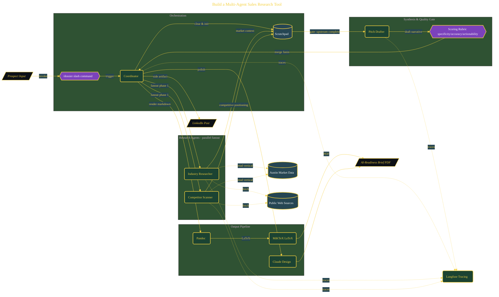

# Build a Multi-Agent Sales Research Tool

> Inside the [Solo Startup Systems Engineering](../../README.md) portfolio · *Systems for building and scaling a startup as a solo operator.*

## Overview

-T-h-i-s- -p-r-o-j-e-c-t- -b-u-i-l-d-s- -a- -m-u-l-t-i---a-g-e-n-t- -r-e-s-e-a-r-c-h- -s-y-s-t-e-m- -d-e-s-i-g-n-e-d- -t-o- -g-e-n-e-r-a-t-e- -A-I---R-e-a-d-i-n-e-s-s- -B-r-i-e-f-s- -f-o-r- -S-M-B- -p-r-o-s-p-e-c-t-s- -i-n- -u-n-d-e-r- -1-5- -m-i-n-u-t-e-s-.-
-
-T-h-e- -s-y-s-t-e-m- -r-e-p-l-a-c-e-s- -m-a-n-u-a-l- -r-e-s-e-a-r-c-h- -w-o-r-k-f-l-o-w-s- -w-i-t-h- -c-o-o-r-d-i-n-a-t-e-d- -s-u-b-a-g-e-n-t-s- -t-h-a-t- -g-a-t-h-e-r-,- -a-n-a-l-y-z-e-,- -a-n-d- -s-y-n-t-h-e-s-i-z-e- -m-a-r-k-e-t- -d-a-t-a- -i-n-t-o- -a- -s-t-r-u-c-t-u-r-e-d- -o-u-t-p-u-t-.- -T-h-e- -o-b-j-e-c-t-i-v-e- -i-s- -t-o- -m-o-v-e- -f-r-o-m- -f-r-a-g-m-e-n-t-e-d- -r-e-s-e-a-r-c-h- -t-o- -a- -r-e-p-e-a-t-a-b-l-e- -p-i-p-e-l-i-n-e- -t-h-a-t- -p-r-o-d-u-c-e-s- -c-o-n-s-i-s-t-e-n-t-,- -h-i-g-h---q-u-a-l-i-t-y- -p-r-o-s-p-e-c-t- -i-n-t-e-l-l-i-g-e-n-c-e- -a-r-t-i-f-a-c-t-s-.-

The architecture is built across **10 phases**, anchored by **Building PineappleExpressAI's Prospect Research Engine** on the input side and **Scale Testing Across Three Austin Verticals** at the end. Each phase is listed in the Implementation section below.

## Architecture

The diagram shows the topology and data flow of the system as built. The full architectural narrative, with screenshots and prose, lives in [`documents/multi-agent-sales-research.md`](./documents/multi-agent-sales-research.md).

## Implementation

This system is built across **10 phases**:

1. **Building PineappleExpressAI's Prospect Research Engine**
2. **Setting Up the Automation Toolkit**
3. **Scaffolding the Project with AI Assistance**
4. **Designing Subagent Contracts in Claude Desktop**
5. **Building the /dossier Coordinator Command**
6. **Validating Across Two Austin Verticals**
7. **Tracing Multi-Agent Execution with Langfuse**
8. **Mapping the Architecture with C4 Diagrams**
9. **Polishing the Brief into a Sales-Ready Visual**
10. **Scale Testing Across Three Austin Verticals**, -.

For the full walkthrough with screenshots and step-by-step content, see [`documents/multi-agent-sales-research.md`](./documents/multi-agent-sales-research.md).

## Validation

Build outcomes verified end-to-end. Each phase below is captured with screenshots, configuration, and observable behavior in [`documents/multi-agent-sales-research.md`](./documents/multi-agent-sales-research.md):

- ✅ Building PineappleExpressAI's Prospect Research Engine
- ✅ Setting Up the Automation Toolkit
- ✅ Scaffolding the Project with AI Assistance
- ✅ Designing Subagent Contracts in Claude Desktop
- ✅ Building the /dossier Coordinator Command
- ✅ Validating Across Two Austin Verticals
- ✅ Tracing Multi-Agent Execution with Langfuse
- ✅ Mapping the Architecture with C4 Diagrams
- ✅ Polishing the Brief into a Sales-Ready Visual
- ✅ Scale Testing Across Three Austin Verticals
