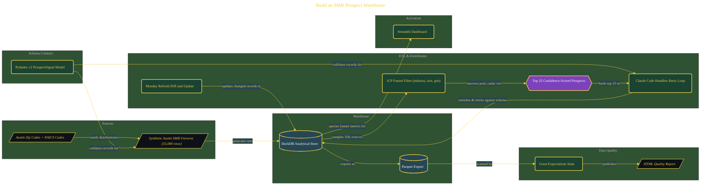

# Build an SMB Prospect Warehouse

> Inside the [Solo Startup Systems Engineering](../../README.md) portfolio · *Systems for building and scaling a startup as a solo operator.*

## Overview

-T-h-i-s- -p-r-o-j-e-c-t- -b-u-i-l-d-s- -a- -l-o-c-a-l- -p-r-o-s-p-e-c-t- -i-n-t-e-l-l-i-g-e-n-c-e- -w-a-r-e-h-o-u-s-e- -d-e-s-i-g-n-e-d- -t-o- -i-d-e-n-t-i-f-y- -a-n-d- -p-r-i-o-r-i-t-i-z-e- -h-i-g-h---v-a-l-u-e- -S-M-B- -c-l-i-e-n-t-s- -i-n- -t-h-e- -A-u-s-t-i-n- -m-a-r-k-e-t-.-
-
-T-h-e- -s-y-s-t-e-m- -i-s- -s-t-r-u-c-t-u-r-e-d- -a-r-o-u-n-d- -a- -s-c-h-e-m-a---f-i-r-s-t- -a-p-p-r-o-a-c-h-,- -w-h-e-r-e- -d-a-t-a- -c-o-n-t-r-a-c-t-s- -a-r-e- -d-e-f-i-n-e-d- -b-e-f-o-r-e- -i-n-g-e-s-t-i-o-n-.- -C-l-a-u-d-e- -i-s- -u-s-e-d- -a-s- -a-n- -e-n-r-i-c-h-m-e-n-t- -e-n-g-i-n-e-,- -w-h-i-l-e- -D-u-c-k-D-B- -s-e-r-v-e-s- -a-s- -t-h-e- -a-n-a-l-y-t-i-c-a-l- -s-t-o-r-a-g-e- -l-a-y-e-r-.- -T-h-e- -g-o-a-l- -i-s- -t-o- -s-i-m-u-l-a-t-e- -a- -p-r-o-d-u-c-t-i-o-n---r-e-a-d-y- -p-i-p-e-l-i-n-e- -t-h-a-t- -c-a-n- -g-e-n-e-r-a-t-e-,- -f-i-l-t-e-r-,- -e-n-r-i-c-h-,- -v-a-l-i-d-a-t-e-,- -a-n-d- -s-u-r-f-a-c-e- -p-r-o-s-p-e-c-t- -d-a-t-a- -f-o-r- -d-e-c-i-s-i-o-n---m-a-k-i-n-g-.-

The architecture is built across **8 phases**, anchored by **Building a Schema-First Prospect Intelligence System** on the input side and **Adding a Monday Refresh with Staleness Detection** at the end. Each phase is listed in the Implementation section below.

## Architecture

The diagram shows the topology and data flow of the system as built. The full architectural narrative, with screenshots and prose, lives in [`documents/smb-prospect-warehouse.md`](./documents/smb-prospect-warehouse.md).

## Implementation

This system is built across **8 phases**:

1. **Building a Schema-First Prospect Intelligence System**
2. **Verifying Claude Code and the Development Environment**, -.
3. **Designing the 12-Field Pydantic Schema with Claude Desktop**
4. **Generating the 55,000-Row Austin SMB Universe**
5. **Applying the ICP Funnel to Surface the Top 25 Prospects**
6. **Enriching Prospects with Claude Code's Headless Retry Loop**
7. **Loading the Warehouse, Certifying Data Quality, and Launching the Dashboard**
8. **Adding a Monday Refresh with Staleness Detection**, -.

For the full walkthrough with screenshots and step-by-step content, see [`documents/smb-prospect-warehouse.md`](./documents/smb-prospect-warehouse.md).

## Validation

Build outcomes verified end-to-end. Each phase below is captured with screenshots, configuration, and observable behavior in [`documents/smb-prospect-warehouse.md`](./documents/smb-prospect-warehouse.md):

- ✅ Building a Schema-First Prospect Intelligence System
- ✅ Verifying Claude Code and the Development Environment
- ✅ Designing the 12-Field Pydantic Schema with Claude Desktop
- ✅ Generating the 55,000-Row Austin SMB Universe
- ✅ Applying the ICP Funnel to Surface the Top 25 Prospects
- ✅ Enriching Prospects with Claude Code's Headless Retry Loop
- ✅ Loading the Warehouse, Certifying Data Quality, and Launching the Dashboard
- ✅ Adding a Monday Refresh with Staleness Detection
