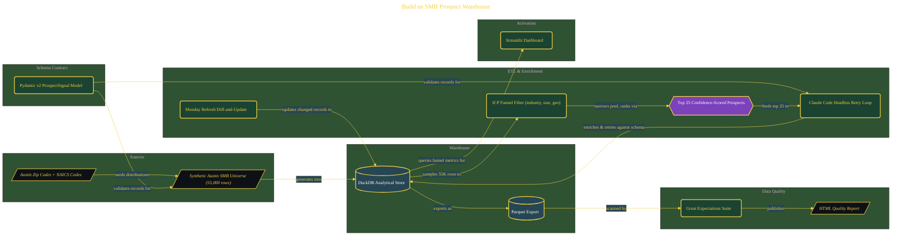

# Build an SMB Prospect Warehouse

> Inside the [Solo Startup Systems Engineering](../../README.md) portfolio · *Systems for building and scaling a startup as a solo operator.*

## Overview

This project builds a local prospect intelligence warehouse designed to identify and prioritize high-value SMB clients in the Austin market.

The system is structured around a schema-first approach, where data contracts are defined before ingestion. Claude is used as an enrichment engine, while DuckDB serves as the analytical storage layer. The goal is to simulate a production-ready pipeline that can generate, filter, enrich, validate, and surface prospect data for decision-making.

The architecture is built across **8 phases**, anchored by **Building a Schema-First Prospect Intelligence System** on the input side and **Adding a Monday Refresh with Staleness Detection** at the end. Each phase is listed in the Implementation section below.

## Architecture

The diagram shows the topology and data flow of the system as built. The full architectural narrative, with screenshots and prose, lives in [`documents/smb-prospect-warehouse.md`](./documents/smb-prospect-warehouse.md).

## Implementation

This system is built across **8 phases**:

1. **Building a Schema-First Prospect Intelligence System**
2. **Verifying Claude Code and the Development Environment**
3. **Designing the 12-Field Pydantic Schema with Claude Desktop**
4. **Generating the 55,000-Row Austin SMB Universe**
5. **Applying the ICP Funnel to Surface the Top 25 Prospects**
6. **Enriching Prospects with Claude Code's Headless Retry Loop**
7. **Loading the Warehouse, Certifying Data Quality, and Launching the Dashboard**
8. **Adding a Monday Refresh with Staleness Detection**

For the full walkthrough with screenshots and step-by-step content, see [`documents/smb-prospect-warehouse.md`](./documents/smb-prospect-warehouse.md).

## Validation

Build outcomes verified end-to-end. Each phase below is captured with screenshots, configuration, and observable behavior in [`documents/smb-prospect-warehouse.md`](./documents/smb-prospect-warehouse.md):

- ✅ Building a Schema-First Prospect Intelligence System
- ✅ Verifying Claude Code and the Development Environment
- ✅ Designing the 12-Field Pydantic Schema with Claude Desktop
- ✅ Generating the 55,000-Row Austin SMB Universe
- ✅ Applying the ICP Funnel to Surface the Top 25 Prospects
- ✅ Enriching Prospects with Claude Code's Headless Retry Loop
- ✅ Loading the Warehouse, Certifying Data Quality, and Launching the Dashboard
- ✅ Adding a Monday Refresh with Staleness Detection
