# Ship a Startup Website with AI Agents

> Inside the [Solo Startup Systems Engineering](../../README.md) portfolio · *Systems for building and scaling a startup as a solo operator.*

## Overview

-T-h-i-s- -p-r-o-j-e-c-t- -b-u-i-l-d-s- -a- -m-u-l-t-i---p-a-g-e- -N-e-x-t-.-j-s- -w-e-b-s-i-t-e- -f-o-r- -a- -f-i-c-t-i-o-n-a-l- -A-I- -a-d-v-i-s-o-r-y- -s-t-a-r-t-u-p-,- -P-i-n-e-a-p-p-l-e-A-I-,- -u-s-i-n-g- -p-a-r-a-l-l-e-l- -A-I- -a-g-e-n-t-s- -i-n-s-i-d-e- -A-n-t-i-g-r-a-v-i-t-y- -I-D-E-.-
-
-T-h-e- -o-b-j-e-c-t-i-v-e- -i-s- -t-o- -d-e-l-i-v-e-r- -a- -p-r-o-d-u-c-t-i-o-n---r-e-a-d-y- -s-i-t-e- -w-i-t-h- -a- -l-a-n-d-i-n-g- -p-a-g-e-,- -s-e-r-v-i-c-e-s- -p-a-g-e-,- -a-b-o-u-t- -p-a-g-e-,- -a-n-d- -c-o-n-t-a-c-t- -f-o-r-m- -w-i-t-h-i-n- -a- -c-o-n-s-t-r-a-i-n-e-d- -t-i-m-e- -w-i-n-d-o-w-.- -T-h-e- -f-o-c-u-s- -i-s- -n-o-t- -j-u-s-t- -s-p-e-e-d-,- -b-u-t- -p-r-o-v-i-n-g- -t-h-a-t- -c-o-o-r-d-i-n-a-t-e-d- -A-I- -a-g-e-n-t-s- -c-a-n- -g-e-n-e-r-a-t-e-,- -v-a-l-i-d-a-t-e-,- -a-n-d- -d-e-p-l-o-y- -a- -c-o-m-p-l-e-t-e- -w-e-b- -s-y-s-t-e-m- -w-h-i-l-e- -m-a-i-n-t-a-i-n-i-n-g- -c-o-n-s-i-s-t-e-n-c-y- -a-c-r-o-s-s- -a-r-c-h-i-t-e-c-t-u-r-e-,- -d-e-s-i-g-n-,- -a-n-d- -a-c-c-e-s-s-i-b-i-l-i-t-y-.-

The architecture is built across **10 phases**, anchored by **Shipping a Real Startup Website with AI-Assisted Development** on the input side and **Case Studies Page with Animations and Dark/Light Mode** at the end. Each phase is listed in the Implementation section below.

## Architecture

```mermaid
---
title: Ship a Startup Website with AI Agents
---
%%{init: {"theme":"base","themeVariables": {"primaryColor":"#1B4332","primaryTextColor":"#F4D03F","primaryBorderColor":"#F4D03F","secondaryColor":"#264653","tertiaryColor":"#2F5233","lineColor":"#F4D03F","fontFamily":"ui-monospace, SFMono-Regular, Menlo, Consolas, monospace","fontSize":"13px"}}}%%
flowchart LR
    classDef datastore fill:#264653,stroke:#F4D03F,stroke-width:2px,color:#FFFFFF
    classDef service fill:#1B4332,stroke:#F4D03F,stroke-width:2px,color:#F4D03F
    classDef event fill:#7B42BC,stroke:#F4D03F,stroke-width:2px,color:#FFFFFF
    classDef io fill:#0d1117,stroke:#F4D03F,stroke-width:1.5px,color:#F4D03F,font-style:italic







    AGENTSMD[/"AGENTS.md control layer"/]

    subgraph Planning["Planning"]
        GeminiPro("Gemini Pro - architecture")
    end

    subgraph BuildAgents["Parallel Build Agents (Antigravity IDE)"]
        GeminiFlash("Gemini Flash - UI scaffolding")
        LandingAgent("Landing Page Agent")
        ServicesAgent("Services Page Agent")
        AboutAgent("About Page Agent")
        ContactAgent("Contact Form Agent")
        ThemeAgent("Case Studies / Theme Agent")
    end

    subgraph SiteCode["Next.js App (TS + Tailwind)"]
        FeatureBranches[("Git feature branches")]
        MainBranch[("main branch")]
    end

    subgraph Validation["Validation"]
        AxeCore("axe-core WCAG 2.2 AA")
        Playwright("Playwright E2E")
    end

    subgraph DeployHost["Deploy & Host"]
        MergeEvent{{"Merge to main"}}
        Vercel("Vercel hosting")
        LiveSite[/"pineapple-ai-eight.vercel.app"/]
    end

    AGENTSMD -->|"governs"| GeminiPro
    AGENTSMD -->|"governs"| GeminiFlash
    GeminiPro -->|"defines tokens & hierarchy"| BuildAgents
    GeminiPro -->|"reasons SSR theme"| ThemeAgent

    GeminiFlash -->|"scaffolds UI"| LandingAgent
    GeminiFlash -->|"scaffolds UI"| ServicesAgent
    GeminiFlash -->|"scaffolds UI"| AboutAgent

    LandingAgent -->|"writes to"| FeatureBranches
    ServicesAgent -->|"writes to"| FeatureBranches
    AboutAgent -->|"writes to"| FeatureBranches
    ContactAgent -->|"writes to"| FeatureBranches
    ThemeAgent -->|"writes to"| FeatureBranches

    FeatureBranches -->|"scans a11y"| AxeCore
    FeatureBranches -->|"runs E2E"| Playwright
    AxeCore -->|"zero violations"| MergeEvent
    Playwright -->|"passes"| MergeEvent
    MergeEvent -->|"merges into"| MainBranch
    MainBranch -->|"deploys"| Vercel
    Vercel -->|"publishes"| LiveSite
class FeatureBranches,MainBranch datastore
class MergeEvent event

    class FeatureBranches,MainBranch datastore
    class GeminiPro,GeminiFlash,LandingAgent,ServicesAgent,AboutAgent,ContactAgent,ThemeAgent,AxeCore,Playwright,Vercel service
    class MergeEvent event
    class AGENTSMD,LiveSite io
```

The diagram shows the topology and data flow of the system as built. The full architectural narrative, with screenshots and prose, lives in [`documents/startup-site-ai-agents.md`](./documents/startup-site-ai-agents.md).

## Implementation

This system is built across **10 phases**:

1. **Shipping a Real Startup Website with AI-Assisted Development**
2. **Setting Up the Development Environment**
3. **Planning the Architecture with Gemini Pro**
4. **Building the Landing Page**
5. **Running Parallel Agents to Build Services and About Pages**
6. **Building an Accessible Contact Form**
7. **Achieving Zero Accessibility Violations with axe-core**
8. **Writing E2E Tests with Playwright**
9. **Merging Branches and Deploying to Vercel**
10. **Case Studies Page with Animations and Dark/Light Mode**, -.

For the full walkthrough with screenshots and step-by-step content, see [`documents/startup-site-ai-agents.md`](./documents/startup-site-ai-agents.md).

## Validation

Build outcomes verified end-to-end. Each phase below is captured with screenshots, configuration, and observable behavior in [`documents/startup-site-ai-agents.md`](./documents/startup-site-ai-agents.md):

- ✅ Shipping a Real Startup Website with AI-Assisted Development
- ✅ Setting Up the Development Environment
- ✅ Planning the Architecture with Gemini Pro
- ✅ Building the Landing Page
- ✅ Running Parallel Agents to Build Services and About Pages
- ✅ Building an Accessible Contact Form
- ✅ Achieving Zero Accessibility Violations with axe-core
- ✅ Writing E2E Tests with Playwright
- ✅ Merging Branches and Deploying to Vercel
- ✅ Case Studies Page with Animations and Dark/Light Mode
