# Ship a Startup Website with AI Agents

> Inside the [Solo Startup Systems Engineering](../../README.md) portfolio · *Systems for building and scaling a startup as a solo operator.*

## Overview

This project builds a multi-page Next.js website for a fictional AI advisory startup, PineappleAI, using parallel AI agents inside Antigravity IDE.

The objective is to deliver a production-ready site with a landing page, services page, about page, and contact form within a constrained time window. The focus is not just speed, but proving that coordinated AI agents can generate, validate, and deploy a complete web system while maintaining consistency across architecture, design, and accessibility.

The architecture is built across **10 phases**, anchored by **Shipping a Real Startup Website with AI-Assisted Development** on the input side and **Case Studies Page with Animations and Dark/Light Mode** at the end. Each phase is listed in the Implementation section below.

## Architecture

```mermaid
---
title: Ship a Startup Website with AI Agents
---
%%{init: {"theme":"base","themeVariables": {"primaryColor":"#1B4332","primaryTextColor":"#F4D03F","primaryBorderColor":"#F4D03F","secondaryColor":"#264653","tertiaryColor":"#2F5233","lineColor":"#F4D03F","fontFamily":"ui-monospace, SFMono-Regular, Menlo, Consolas, monospace","fontSize":"13px"}}}%%
flowchart LR
    classDef datastore fill:#264653,stroke:#F4D03F,stroke-width:2px,color:#FFFFFF
    classDef service fill:#1B4332,stroke:#F4D03F,stroke-width:2px,color:#F4D03F
    classDef event fill:#7B42BC,stroke:#F4D03F,stroke-width:2px,color:#FFFFFF
    classDef io fill:#0d1117,stroke:#F4D03F,stroke-width:1.5px,color:#F4D03F,font-style:italic







    AGENTSMD[/"AGENTS.md control layer"/]

    subgraph Planning["Planning"]
        GeminiPro("Gemini Pro - architecture")
    end

    subgraph BuildAgents["Parallel Build Agents (Antigravity IDE)"]
        GeminiFlash("Gemini Flash - UI scaffolding")
        LandingAgent("Landing Page Agent")
        ServicesAgent("Services Page Agent")
        AboutAgent("About Page Agent")
        ContactAgent("Contact Form Agent")
        ThemeAgent("Case Studies / Theme Agent")
    end

    subgraph SiteCode["Next.js App (TS + Tailwind)"]
        FeatureBranches[("Git feature branches")]
        MainBranch[("main branch")]
    end

    subgraph Validation["Validation"]
        AxeCore("axe-core WCAG 2.2 AA")
        Playwright("Playwright E2E")
    end

    subgraph DeployHost["Deploy & Host"]
        MergeEvent{{"Merge to main"}}
        Vercel("Vercel hosting")
        LiveSite[/"pineapple-ai-eight.vercel.app"/]
    end

    AGENTSMD -->|"governs"| GeminiPro
    AGENTSMD -->|"governs"| GeminiFlash
    GeminiPro -->|"defines tokens & hierarchy"| BuildAgents
    GeminiPro -->|"reasons SSR theme"| ThemeAgent

    GeminiFlash -->|"scaffolds UI"| LandingAgent
    GeminiFlash -->|"scaffolds UI"| ServicesAgent
    GeminiFlash -->|"scaffolds UI"| AboutAgent

    LandingAgent -->|"writes to"| FeatureBranches
    ServicesAgent -->|"writes to"| FeatureBranches
    AboutAgent -->|"writes to"| FeatureBranches
    ContactAgent -->|"writes to"| FeatureBranches
    ThemeAgent -->|"writes to"| FeatureBranches

    FeatureBranches -->|"scans a11y"| AxeCore
    FeatureBranches -->|"runs E2E"| Playwright
    AxeCore -->|"zero violations"| MergeEvent
    Playwright -->|"passes"| MergeEvent
    MergeEvent -->|"merges into"| MainBranch
    MainBranch -->|"deploys"| Vercel
    Vercel -->|"publishes"| LiveSite
class FeatureBranches,MainBranch datastore
class MergeEvent event

    class FeatureBranches,MainBranch datastore
    class GeminiPro,GeminiFlash,LandingAgent,ServicesAgent,AboutAgent,ContactAgent,ThemeAgent,AxeCore,Playwright,Vercel service
    class MergeEvent event
    class AGENTSMD,LiveSite io
```

The diagram shows the topology and data flow of the system as built. The full architectural narrative, with screenshots and prose, lives in [`documents/startup-site-ai-agents.md`](./documents/startup-site-ai-agents.md).

## Implementation

This system is built across **10 phases**:

1. **Shipping a Real Startup Website with AI-Assisted Development**
2. **Setting Up the Development Environment**
3. **Planning the Architecture with Gemini Pro**
4. **Building the Landing Page**
5. **Running Parallel Agents to Build Services and About Pages**
6. **Building an Accessible Contact Form**
7. **Achieving Zero Accessibility Violations with axe-core**
8. **Writing E2E Tests with Playwright**
9. **Merging Branches and Deploying to Vercel**
10. **Case Studies Page with Animations and Dark/Light Mode**

For the full walkthrough with screenshots and step-by-step content, see [`documents/startup-site-ai-agents.md`](./documents/startup-site-ai-agents.md).

## Validation

Build outcomes verified end-to-end. Each phase below is captured with screenshots, configuration, and observable behavior in [`documents/startup-site-ai-agents.md`](./documents/startup-site-ai-agents.md):

- ✅ Shipping a Real Startup Website with AI-Assisted Development
- ✅ Setting Up the Development Environment
- ✅ Planning the Architecture with Gemini Pro
- ✅ Building the Landing Page
- ✅ Running Parallel Agents to Build Services and About Pages
- ✅ Building an Accessible Contact Form
- ✅ Achieving Zero Accessibility Violations with axe-core
- ✅ Writing E2E Tests with Playwright
- ✅ Merging Branches and Deploying to Vercel
- ✅ Case Studies Page with Animations and Dark/Light Mode
